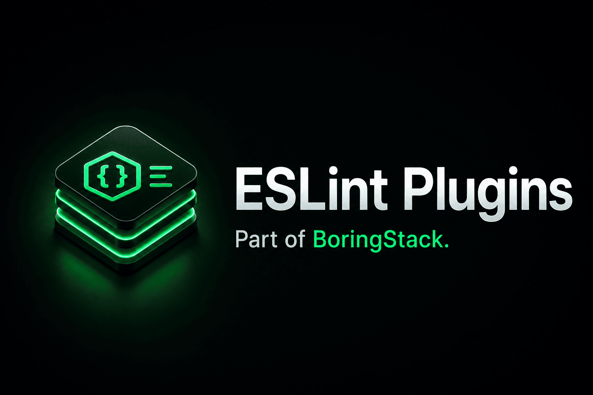

<p align="center">
  <a href="https://boringstack.xyz/architecture/lint-as-contract/">
    
  </a>
</p>

<p align="center">
  <a href="https://boringstack.xyz"></a>
  <a href="https://boringstack.xyz/architecture/lint-as-contract/"></a>
  <a href="https://github.com/boringstack-xyz/eslint-plugins"></a>
</p>

<p align="center">
  
  
  
  
</p>

# eslint-plugins

Part of [BoringStack](https://boringstack.xyz).

Monorepo of custom ESLint plugins used across the Boring Stack templates. All packages are published to npm under the `@boring-stack-pkg` scope.

For documentation on how architecture rules are enforced in CI and review, see [Lint as a contract](https://boringstack.xyz/architecture/lint-as-contract/).

## Packages

| Package                                                                                                        | Description                                     |
| -------------------------------------------------------------------------------------------------------------- | ----------------------------------------------- |
| [`@boring-stack-pkg/eslint-plugin-audit-log`](./eslint-plugin-audit-log)                                       | Audit mutations, prevent PII in audit metadata. |
| [`@boring-stack-pkg/eslint-plugin-bullmq`](./eslint-plugin-bullmq)                                             | BullMQ job conventions and safety.              |
| [`@boring-stack-pkg/eslint-plugin-cache-keys`](./eslint-plugin-cache-keys)                                     | Cache key conventions and collision prevention. |
| [`@boring-stack-pkg/eslint-plugin-code-flow`](./eslint-plugin-code-flow)                                       | Control-flow conventions.                       |
| [`@boring-stack-pkg/eslint-plugin-comment-hygiene`](./eslint-plugin-comment-hygiene)                           | Block low-value / stale comments.               |
| [`@boring-stack-pkg/eslint-plugin-db-transactions`](./eslint-plugin-db-transactions)                           | DB transaction discipline.                      |
| [`@boring-stack-pkg/eslint-plugin-drizzle-conventions`](./eslint-plugin-drizzle-conventions)                   | Drizzle ORM usage rules.                        |
| [`@boring-stack-pkg/eslint-plugin-elysia`](./eslint-plugin-elysia)                                             | Elysia framework conventions.                   |
| [`@boring-stack-pkg/eslint-plugin-env-access`](./eslint-plugin-env-access)                                     | Centralised, typed env access.                  |
| [`@boring-stack-pkg/eslint-plugin-i18n-keys`](./eslint-plugin-i18n-keys)                                       | i18n key conventions.                           |
| [`@boring-stack-pkg/eslint-plugin-jwt-cookies`](./eslint-plugin-jwt-cookies)                                   | JWT-in-cookie safety.                           |
| [`@boring-stack-pkg/eslint-plugin-module-boundaries`](./eslint-plugin-module-boundaries)                       | Cross-module import boundaries.                 |
| [`@boring-stack-pkg/eslint-plugin-oauth-security`](./eslint-plugin-oauth-security)                             | OAuth implementation guardrails.                |
| [`@boring-stack-pkg/eslint-plugin-react-component-architecture`](./eslint-plugin-react-component-architecture) | React component layering.                       |
| [`@boring-stack-pkg/eslint-plugin-resource-architecture`](./eslint-plugin-resource-architecture)               | Resource-oriented backend architecture.         |
| [`@boring-stack-pkg/eslint-plugin-stripe-webhooks`](./eslint-plugin-stripe-webhooks)                           | Stripe webhook safety.                          |
| [`@boring-stack-pkg/eslint-plugin-structured-logging`](./eslint-plugin-structured-logging)                     | Structured logging conventions.                 |
| [`@boring-stack-pkg/eslint-plugin-tanstack-query-cache`](./eslint-plugin-tanstack-query-cache)                 | TanStack Query cache key conventions.           |
| [`@boring-stack-pkg/eslint-plugin-test-conventions`](./eslint-plugin-test-conventions)                         | Test layout and naming.                         |

## Development

```bash
pnpm install
pnpm -r build
pnpm -r test
```

## Releasing

Releases are driven by [Changesets](https://github.com/changesets/changesets):

1. Make a change, then run `pnpm changeset` and follow the prompts to record the bump.
2. Commit the generated `.changeset/*.md` and open a PR.
3. When the PR merges to `main`, the `Release` workflow opens (or updates) a "Version Packages" PR that bumps versions and updates changelogs.
4. Merging that PR publishes the affected packages to npm with provenance.

Publishing authenticates with an `NPM_TOKEN` automation token (stored as a GitHub Actions secret) and signs each release with [npm provenance](https://docs.npmjs.com/generating-provenance-statements) via GitHub OIDC — every published version carries a "Built and signed on GitHub Actions" badge linking back to the workflow run.

## License

MIT
