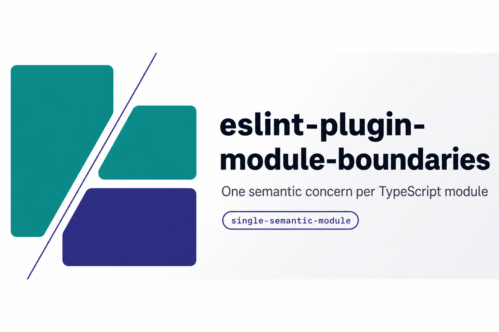

# eslint-plugin-module-boundaries



[](https://github.com/agjs/eslint-plugin-module-boundaries/actions/workflows/ci.yml)


Production-oriented ESLint rules for deterministic TypeScript module cohesion.

The main rule, `module-boundaries/single-semantic-module`, enforces one semantic top-level concern per file. It analyzes TypeScript and TSX AST nodes, not filenames, so a mixed module fails regardless of whether it is named `types.ts`, `utils.ts`, `anything.ts`, or something else.

## Why

AI-generated codebases often accumulate unrelated declarations in whichever file is already open: types beside constants, schemas beside functions, hooks beside components. This plugin makes that architectural drift fail during linting.

## Install

```sh
npm install --save-dev eslint-plugin-module-boundaries @typescript-eslint/parser
```

## Flat config

```js
import tsParser from "@typescript-eslint/parser";
import moduleBoundaries from "eslint-plugin-module-boundaries";

export default [
  {
    files: ["**/*.{ts,tsx}"],
    languageOptions: {
      parser: tsParser,
      parserOptions: {
        ecmaVersion: "latest",
        sourceType: "module",
        ecmaFeatures: { jsx: true }
      }
    },
    plugins: {
      "module-boundaries": moduleBoundaries
    },
    rules: {
      "module-boundaries/single-semantic-module": "error"
    }
  }
];
```

You can also use the built-in flat config:

```js
import moduleBoundaries from "eslint-plugin-module-boundaries";

export default [moduleBoundaries.configs.recommended];
```

## Rule behavior

The rule walks top-level module declarations and classifies each declaration into one semantic category. Imports, re-exports, export lists without declarations, type-only imports, type-only exports, comments, empty statements, and nested declarations are ignored.

Default categories:

| Category | Examples |
| --- | --- |
| `type` | `interface`, `type`, ambient declarations, TypeScript namespaces |
| `constant` | top-level runtime values, literals, objects, arrays, templates, computed values |
| `function` | function declarations, function expressions, arrow functions |
| `class` | class declarations and class expressions |
| `react-component` | PascalCase functions or variables returning JSX, `React.FC`, `FunctionComponent` |
| `hook` | functions/variables matching `^use[A-Z0-9].*` |
| `schema` | zod, yup, and valibot schema builder expressions |
| `enum` | TypeScript enum declarations by default |

If more than one category is detected, the rule reports:

```txt
Mixed semantic categories detected in module:
- type
- constant

A module must contain only one semantic concern.
Move declarations into separate files/modules.
```

## Configuration

```js
{
  rules: {
    "module-boundaries/single-semantic-module": [
      "error",
      {
        allow: [
          ["type", "schema"],
          ["react-component", "hook"]
        ],
        enumCategory: "enum",
        debug: false,
        ignoreAmbientDeclarations: false,
        schemaLibraries: ["zod", "yup", "valibot"],
        reactComponentDetection: {
          enabled: true
        },
        hookDetection: {
          enabled: true,
          namePattern: "^use[A-Z0-9].*"
        }
      }
    ]
  }
}
```

### `allow`

Allows specific combinations of semantic categories. For example, `["type", "schema"]` permits modules containing both types and schemas, while all other mixed combinations still fail.

### `enumCategory`

Controls enum classification:

- `"enum"`: enums are their own runtime category.
- `"type"`: enums are allowed in type-only modules.

### `debug`

Includes declaration names and classification reasons in the lint error.

### `ignoreAmbientDeclarations`

When `true`, ambient declarations such as `declare global` are ignored instead of classified as `type`.

## Examples

Valid:

```ts
export interface User {}
export type UserId = string;
```

```ts
export const USER_ROLE_ADMIN = "admin";
export const USER_ROLE_USER = "user";
```

```ts
export function createUser() {}
export function deleteUser() {}
```

Invalid:

```ts
export interface User {}
export const DEFAULT_USER = {};
```

```ts
export const USER_LIMIT = 5;
export function validateUser() {}
```

```ts
export class UserService {}
export function createUser() {}
```

## Development

```sh
npm install
npm test
npm run typecheck
npm run build
```
